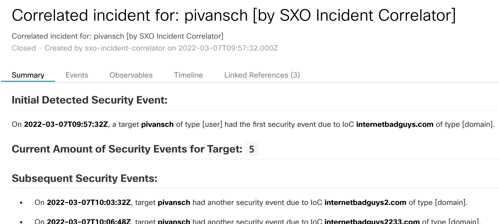
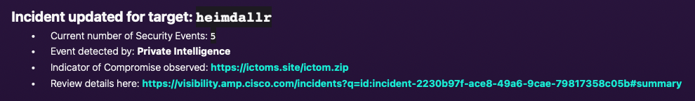
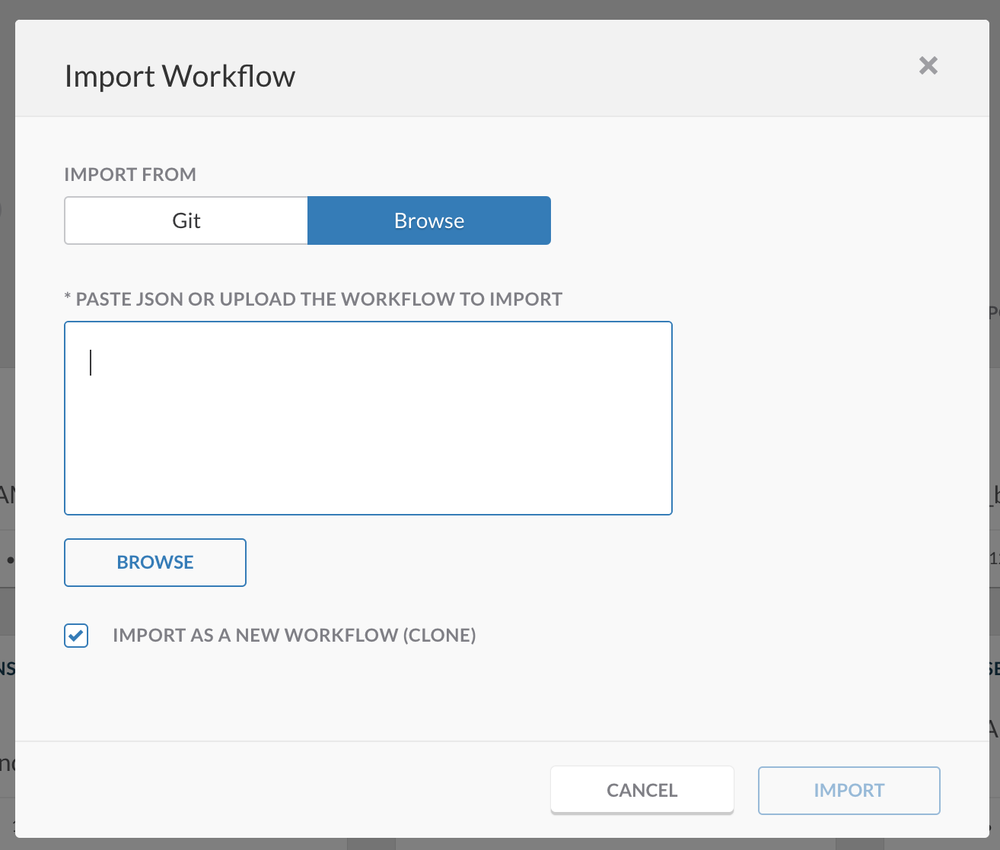
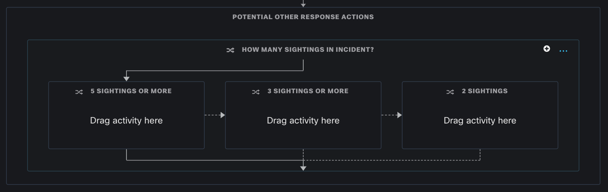

# SecureX Incident Correlator

## Features
* Correlates sightings into a single incident per target identifier (e.g. hostname, mac address etc.).
* Creates a new incident if target identifier was not seen before (i.e. no incident was created) or if the incident was closed for that target identifier.
* If the incident was closed for that target identifier, it will create a new incident and a relationship with the previous incident.
* Keeps track of amount of sightings per incident. This number is reported via Webex Teams and also stored and updated in the incident description.
* Possible to set different response actions based on number of sightings per incident.
* This workflow can have multiple modules. The modules trigger this workflow, when a sighting is found for an IoC with a target.
* Currently the Twitter and Generic module are ready. The RSS feed module is in development. If you have more ideas for modules, please open a GitHub issue or make a GitHub pull request. 

> **Note:** Please test this properly before implementing in a production environment. This is a sample workflow! 

> **Note:** Please review the sub directories of this repository for the modules.

### Example SecureX incident:

### Example Webex notifcation:

## Required Targets and Accounts keys
- SecureX Access Token
- SecureX Private Intel DB (uses SecureX Access Token)
- Webex Teams

## Required Atomic Workflows
- All used atomics are [System Objects](https://ciscosecurity.github.io/sxo-05-security-workflows/atomics/system) and do not need to be imported.

## Setup instructions

1. Browse to your SecureX orchestration instance. This wille be a different URL depending on the region your account is in: 

* US: https://securex-ao.us.security.cisco.com/orch-ui/workflows/
* EU: https://securex-ao.eu.security.cisco.com/orch-ui/workflows/
* APJC: https://securex-ao.apjc.security.cisco.com/orch-ui/workflows/

2. Click on **Browse** and copy paste the content of the [main_workflow.json](https://raw.githubusercontent.com/chrivand/securex_incident_correlator/main/main_workflow.json) file inside of the text window and click **Import**. Select **Import as a new workflow (clone)** if you have a previous version of this workflow, and you do not want to overwrite it. Alternatively, you can also [import this from GitHub directly](https://ciscosecurity.github.io/sxo-05-security-workflows/importing).

> **Note:**  It is possible to integrate the workflow with Webex Teams. In order to do that, an API Access Token and a Room ID need to be entered in the config.json file. Please retrieve your key from: [https://developer.webex.com/docs/api/getting-started](https://developer.webex.com/docs/api/getting-started). Then create a dedicated Webex Teams space for these notifications and retrieve the Room ID from: [https://developer.webex.com/docs/api/v1/rooms/list-rooms](https://developer.webex.com/docs/api/v1/rooms/list-rooms). Please be aware that the personal token from the getting started page only works for 12 hours. Please follow these steps to request a token per request: [https://developer.webex.com/docs/integrations](https://developer.webex.com/docs/integrations).

3. You will be prompted for some credentials and targets. Please follow the instructions to make sure there are no more orange errors in the workflow and you can click **VALIDATE** in the top right of the workflow edit pane.

4. Feel free to add more response actions, based on the amount of sightings per incident:

## Author(s)

* Christopher van der Made (Cisco)
