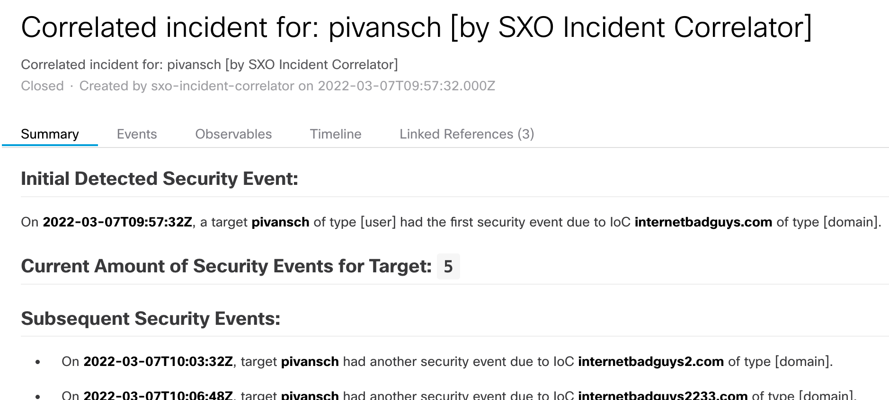
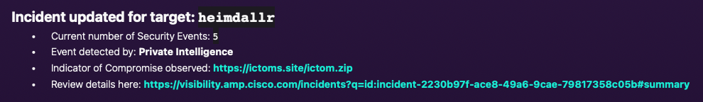

# SecureX orchestration workflow repository

## Features
* SecureX orchestration provides a no-to-low code approach for building automated workflows. 
* This set of workflows correlates sightings into a single incident per target identifier (e.g. hostname, mac address etc.).
* Creates a new incident if target identifier was not seen before (i.e. no incident was created) or if the incident was closed for that target identifier.
* If the incident was closed for that target identifier, it will create a new incident and a relationship with the previous incident.
* Keeps track of amount of sightings per incident. This number is reported via Webex Teams and also stored and updated in the incident description.
* Possible to set different response actions based on number of sightings per incident.
* This workflow can have multiple modules. The modules trigger this workflow, when a sighting is found for an IoC with a target.
* Currently the Twitter and Generic module are ready. The RSS feed module is in development. If you have more ideas for modules, please open a GitHub issue or make a GitHub pull request.

### Example module:

### Example SecureX incident:

### Example Webex notifcation:

## Business Case
This set of workflows allows to automate a part of the Threat Hunting process and correlate multiple events into a single incident.

* Threat Hunting is all about gathering data from Local/Internal Monitoring and Global Intelligence.
* Threat Hunting is a continuous process and a loop.
* There are many tools, like SecureX, that can help with this.
* The SecureX API can automate (parts of) this process and help free up precious time for SOC analysts.

Please continue your reading in this [SecureX white paper](https://www.cisco.com/c/en/us/products/collateral/security/white-paper-c11-744498.html).

## Related Sandbox
Currently there is no DevNet sandbox yet, however you can find all options to try out these [SecureX orchestration learning labs](https://developer.cisco.com/learning/lab/Cisco-SecureX-101-lab/step/1)!

## List of SecureX Learning Labs
* Please try out this [SecureX DevNet learning lab](https://developer.cisco.com/learning/modules/SecureX-orchestration) to try this yourself. 
* Please also check out the [SecureX microsite](https://developer.cisco.com/securex/) on DevNet!

## Solutions on Ecosystem Exchange
Please check out related solutions on [DevNet Ecosystem Exchange](https://developer.cisco.com/ecosystem/solutions/#key=securex).
